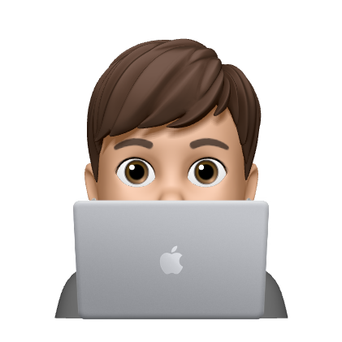

# Hello, world! 👋 

Born in Naples, Italy, I grew up learning new technologies every year since I was 11. I got my high school diploma at I.T.I.S. Alessandro Volta in 2020 after that I started my working career.

- 👨🏻‍💻 I’m Agostino Fiscale but everyone call me Dino
- 🏦 I’m currently working at [Kotuko](https://www.kotuko.it/) as Full Stack developer
- 💻 I’m still trying to learn new technologies
- ⚡ Fun fact: I'm obsessed with TV shows and anime!

#### Technologies and tools

	
	
	
	
	
	
	
	
	
	
	
	
	
	
	
	
	
	
	
	
	
	
	
	
	
	
	
	
	

